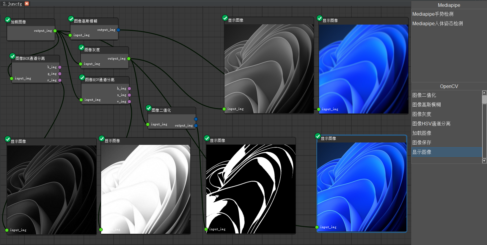
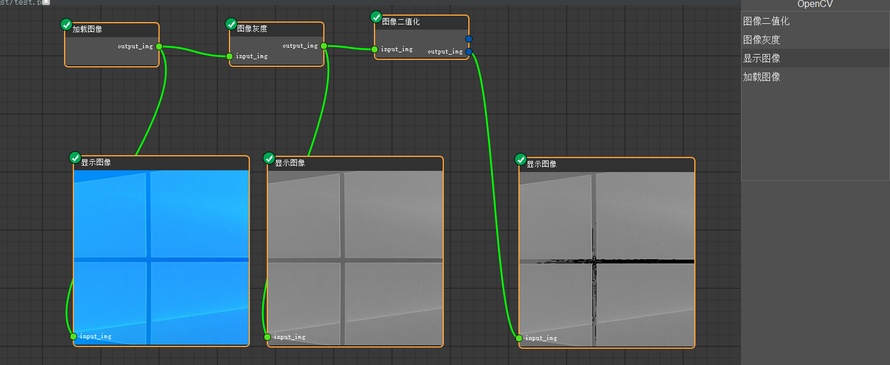
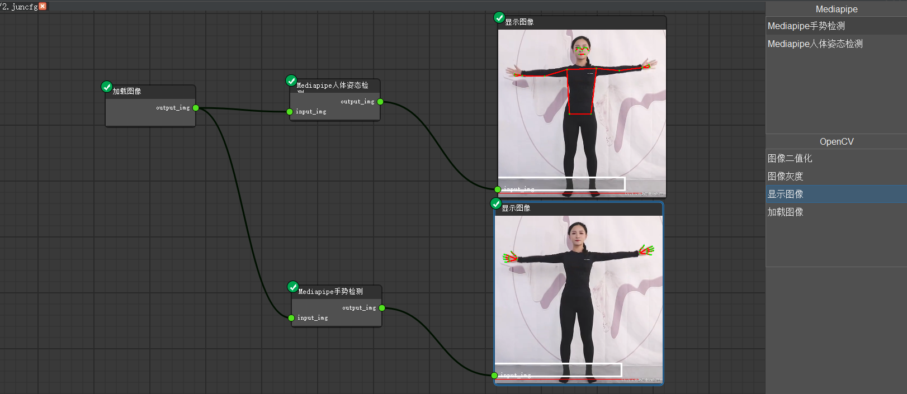
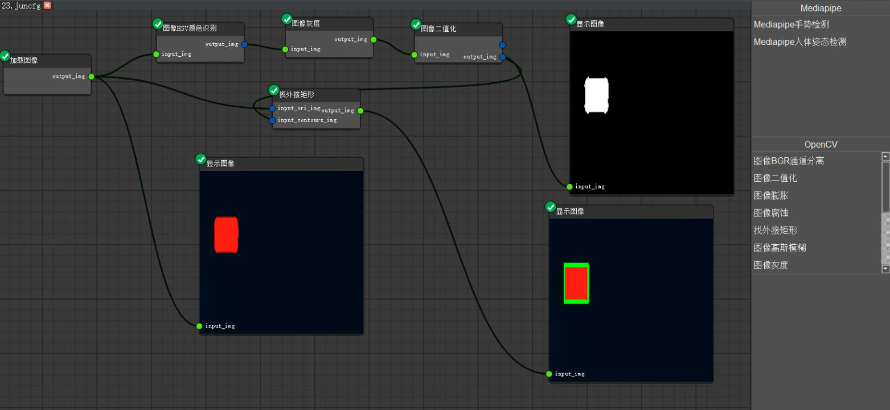
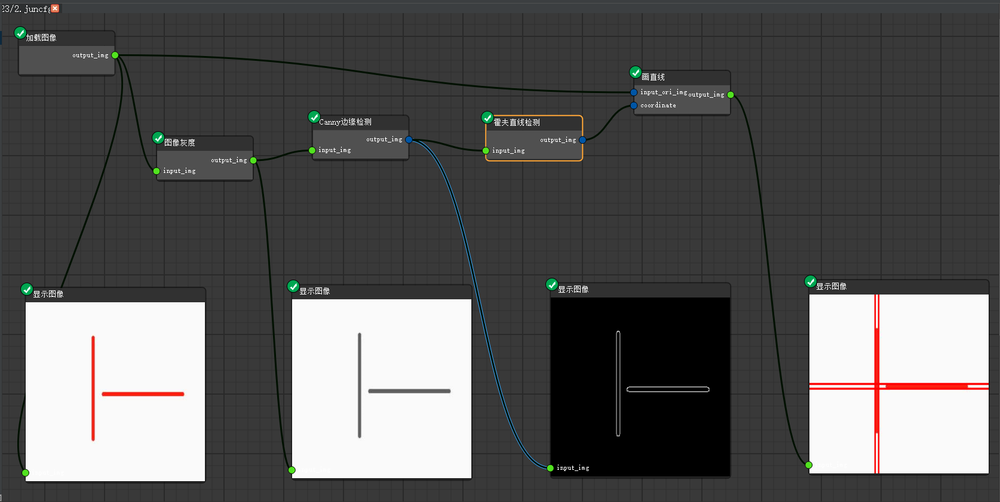
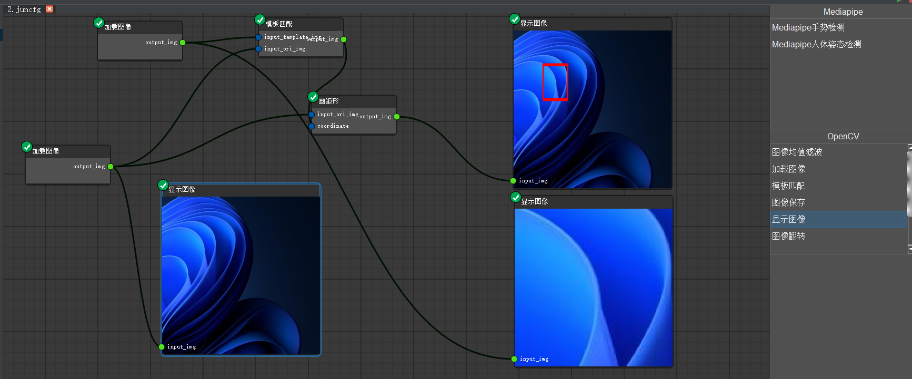

# OpenSV 插件包
## OpenSV平台代码参考以下仓库。

[https://github.com/junasir/OpenSV](https://github.com/junasir/OpenSV)

## 本仓库为OpenSV的插件包。

##### 目前插件支持
###### 一、Opencv
1.图像读取
2.图像灰度
3.图像二值化
4.图像显示
5.图像保存
6.图像BGR通道分离
7.图像HSV通道分离
8.图像高斯模糊
9.图像翻转
10.图像腐蚀
11.图像膨胀
12.图像HSV颜色识别
13.图像找外接矩形
14.图像画直线
15.图像画矩形
16.canny边缘检测
17.模板匹配
18.hough直线检测
19.仿射变换
20.print函数
21.图像中值滤波
22.mediapipe姿态估计
23.mediapipe手势估计

二、Mediapipe

1.姿态检测

2.手势检测

##### 插件预览

